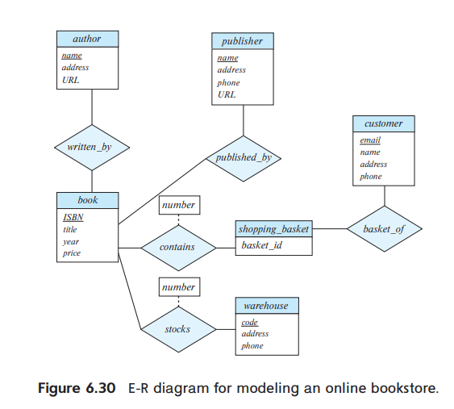

# 6.16
Extend the E-R diagram of Exercise 6.3 to track the same information for all teams in a league

### 6.3
Design an E-R diagram for keeping track of the scoring statistics of your favorite sports team. You should store the matches played, the scores in each match, the players in each match, and individual player scoring statistics for each match.
Summary statistics should be modeled as derived attributes with an explanation as to how they are computed.

## 해설

