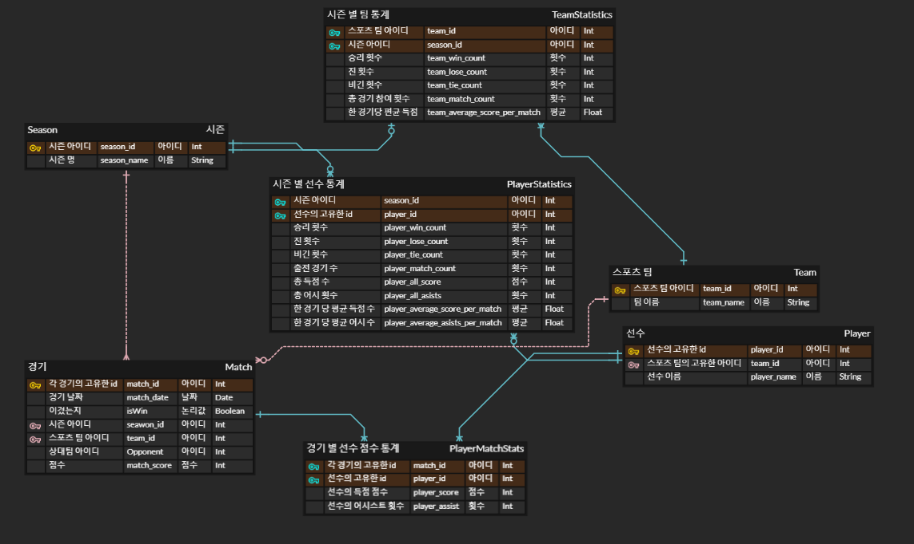

# 6.20
Construct appropriate relation schemas for each of the E-R diagrams in:  
a. Exercise 6.1.
c. Exercise 6.3.

## 해설
### 6.1 (a)
Construct an E-R diagram for a car insurance company whose customers own one or more cars each. Each car has associated with it zero to any number of recorded accidents. Each insurance policy covers one or more cars and has one or more premium payments associated with it. Each payment is for a particular
period of time, and has an associated due date, and the date when the payment was received.
### relation schemas
- Customer (고객)

  - CustomerID (고객 식별자)
  - Name (이름)
  - ContactInfo (연락처 정보)
  
- Car (자동차)
  - CarID (자동차 식별자)
  - CustomerID (고객 식별자, 외래 키)
  - Make (제조사)
  - Model (모델)
  - Year (연도)
  
- Accident (사고)
  - AccidentID (사고 식별자)
  - CarID (자동차 식별자, 외래 키)
  - Date (사고 일자)
  - Description (사고 설명)

- InsurancePolicy (보험 계약)
  - PolicyID (계약 식별자)
  - CustomerID (고객 식별자, 외래 키)
  - CarID (자동차 식별자, 외래 키)
  - CoverageDetails (보상 내용)
  - PremiumAmount (프리미엄 금액)
  - StartDate (계약 시작일)
  - EndDate (계약 종료일)

- Payment (지불)
  - PaymentID (지불 식별자)
  - PolicyID (계약 식별자, 외래 키)
  - Amount (금액)
  - DueDate (마감일)
  - ReceivedDate (수령일)

### 6.3 (c)
Design an E-R diagram for keeping track of the scoring statistics of your favorite sports team. You should store the matches played, the scores in each match, the players in each match, and individual player scoring statistics for each match.
Summary statistics should be modeled as derived attributes with an explanation as to how they are computed.
### relation schemas
- Team (팀)
- Player (선수)
- Match (경기)
- Season (시즌)
- PlayerMatchStats (경기 별 선수 통계)
- TeamStatistics (시즌 별 팀 통계)
- PlayerStatistics (시즌 별 선수 통계)
